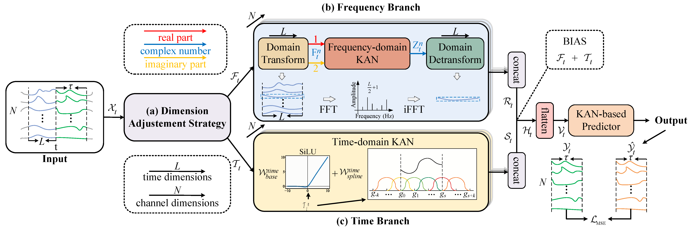

# TFKAN: Time-Frequency KAN for Long-Term Time Series Forecasting

This repository provides the official PyTorch implementation of our paper:

**"TFKAN: Time-Frequency KAN for Long-Term Time Series Forecasting"**

TFKAN introduces a dual-branch architecture that integrates Kolmogorov-Arnold Networks (KANs) into both time and frequency domains. By jointly modeling temporal dynamics and spectral characteristics, TFKAN aims to better capture global periodicity and local variations for long-term time series forecasting.

<p align="center">
  
</p>

**Overview of TFKAN.** The proposed framework consists of a time-domain branch and a frequency-domain branch, where KAN-based adaptive representations are jointly learned to enhance long-term forecasting performance.

The paper has been published in **Neurocomputing**:

📄 Paper: https://www.sciencedirect.com/science/article/pii/S0925231226019569  
🔗 DOI: https://doi.org/10.1016/j.neucom.2026.134558

If you find this repository useful in your research, please consider citing our paper.

---

## Requirements

Dependencies can be installed using the following command:

```bash
pip install -r requirements.txt
```
---
## Getting Started

You can download the datasets as follows:

* **Air Quality** dataset: [UCI Air Quality Dataset](https://archive.ics.uci.edu/dataset/360/air+quality)
* Other six benchmark datasets: [Google Drive Folder](https://drive.google.com/drive/folders/1ZOYpTUa82_jCcxIdTmyr0LXQfvaM9vIy)

After downloading, place them into the folder:

```
./dataset/
```

To train and evaluate TFKAN, simply run:

```bash
python run_longExp.py
```

Alternatively, you can execute a predefined script (e.g., for ETTm1) on a Linux server:

```bash
bash ./scripts/ettm1.sh
```

---
## Citation

If you use the code or ideas from this repository, please cite our paper:

```bibtex
@article{KUI2026134558,
title = {TFKAN: Time-frequency KAN for long-term time series forecasting},
journal = {Neurocomputing},
volume = {701},
pages = {134558},
year = {2026},
issn = {0925-2312},
doi = {10.1016/j.neucom.2026.134558},
url = {https://www.sciencedirect.com/science/article/pii/S0925231226019569},
author = {Xiaoyan Kui and Canwei Liu and Qinsong Li and Zhipeng Hu and Yangyang Shi and Weixin Si and Beiji Zou},
keywords = {Time series forecasting, Long-term forecasting, Kolmogorov–Arnold Networks, Frequency domain, Fourier transform}
}
```
---

## Acknowledgements

We appreciate the following GitHub repositories for their valuable codebases and datasets:

1. [Informer](https://github.com/zhouhaoyi/Informer2020)
2. [Autoformer](https://github.com/thuml/Autoformer)
3. [FEDformer](https://github.com/MAZiqing/FEDformer)
4. [FreTS](https://github.com/aikunyi/FreTS)

---
